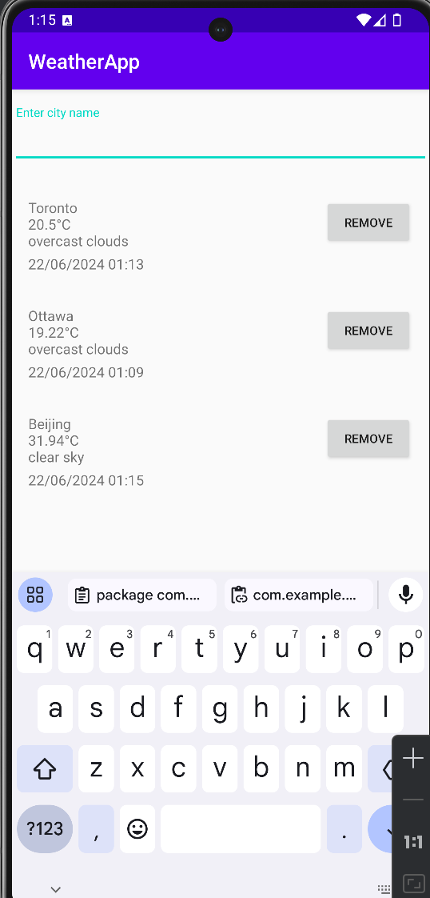

# WeatherApp

WeatherApp is a simple Android app I designed to get current weather information for cities around the world. You can enter a city name to fetch and display the latest weather data including temperature and weather conditions, and other details you wish. It includes a list of cities with temp and condition and dates, which can be updated or removed as needed.

## Features

- Search for current weather by city name.
- Display weather details including temperature, weather conditions and dates.
- Maintain a list of cities with their current weather information.
- Update the weather information for a city.
- Remove cities from the list.
- Integration with OpenWeatherMap API.

## Screenshots



## Setup

### Prerequisites

- Android Studio
- A device or emulator running Android API level 24 or higher.
- OpenWeatherMap API key. You can get one by signing up at [OpenWeatherMap](https://home.openweathermap.org/users/sign_up).

### Installation

1. Clone the repository:
    ```bash
    git clone https://github.com/heming277/WeatherApp.git
    cd WeatherApp
    ```

2. Open the project in Android Studio.

3. Create a file named `local.properties` in the root of the project and add your OpenWeatherMap API key, if the key starts with a number you might need to put it in quotes:
    ```
    API_KEY=your_openweathermap_api_key
    ```

4. Sync the project with Gradle files.

5. Run the project on your device or emulator.

## Usage

1. Open the app on your device or emulator.
2. Enter a city name in the search bar and press "Enter".
3. The current weather information for the city will be displayed.
4. The city will be added to the list below the search bar.
5. You can update the weather information for a city by searching for it again.
6. To remove a city from the list, click the "REMOVE" button next to the city.

## Testing

The app includes Espresso tests to ensure the functionality of the search and display features.

### Running Espresso Tests

1. Ensure you have the Android device or emulator running.
2. In Android Studio, open the `MainActivityTest.kt` file.
3. Click the green arrow next to the class or test method to run the tests.
4. The test results will be displayed in the "Run" window.

### Example Tests

The `MainActivityTest.kt` file includes the following tests:

- `testCurrentWeatherDisplay()`: Checks if the RecyclerView for the weather is displayed.
- `testSearchViewDisplay()`: Checks if the search view is displayed.
- `testEnterCityName()`: Enters a city name in the search view and checks if the RecyclerView is updated with the new weather data.

## Contributing

Contributions are welcome! Please follow these steps:

1. Fork the repository.
2. Create a new branch (`git checkout -b feature/your-feature`).
3. Make your changes and commit them (`git commit -m 'Add some feature'`).
4. Push to the branch (`git push origin feature/your-feature`).
5. Create a new Pull Request.

## License

This project is licensed under the MIT License.

